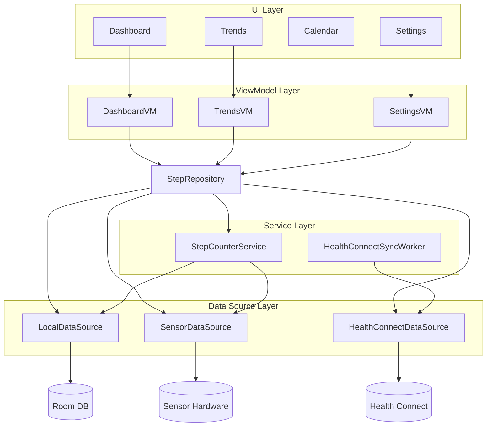
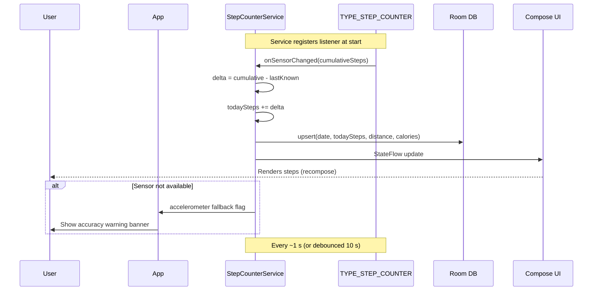
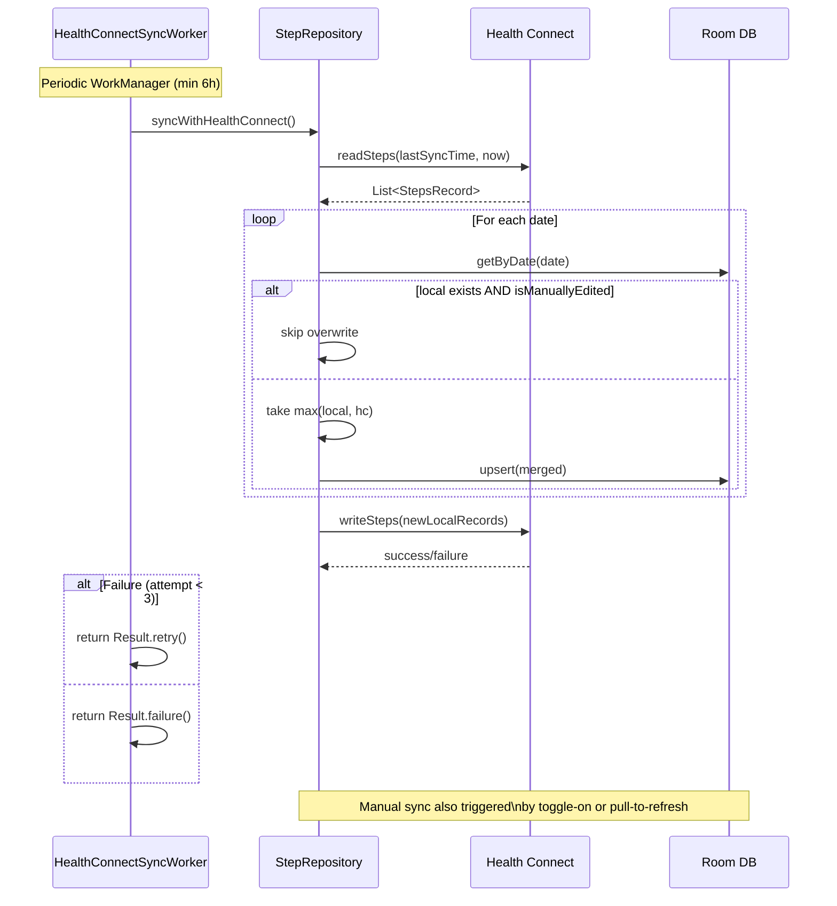

# Technical Design Document

| Version | Date | Author | Description |
| :--- | :--- | :--- | :--- |
| 1.0 | 2026-05-23 | — | Initial technical design based on PRD v1.0 |

---

## 1. Overview

### 1.1 Project Scope

MoWalk is an Android phone-only pedometer app. It uses the device's built-in `TYPE_STEP_COUNTER` sensorfor automatic background step counting, stores data locally in Room, and optionally syncs with Health Connect.

**In scope:** phone sensors, foreground service, Room DB, Health Connect integration, charts, CSV export.
**Out of scope:** wearables, BLE, heart rate / SpO₂ / blood pressure, cloud sync.

### 1.2 Tech Stack

| Category | Choice | Reason |
| :--- | :--- | :--- |
| Language | Kotlin | First-class Android support, coroutines |
| UI | Jetpack Compose + Material 3 | Declarative, modern Android UI |
| Architecture | MVVM | Clean separation, Compose-native |
| Local DB | Room | Type-safe DAOs, Flow integration |
| Sensor API | `SensorManager.TYPE_STEP_COUNTER` | Built-in, zero-battery delta |
| Health Platform | Health Connect SDK 1.2+ | Official Android health data hub |
| Background Work | WorkManager 2.9+ | Reliable periodic sync |
| Charts | MPAndroidChart v3.1.0 | Rich chart types, Compose-interop |
| DI | Manual (no framework) | Keep dependency count low |

### 1.3 Target Platform

- **Min SDK:** 26 (Android 8.0)
- **Target SDK:** 34+
- **Form factor:** Phone only. Tablets and foldables are not proactively supported but should render acceptably.

---

## 2. Architecture

### 2.1 System Architecture Diagram



### 2.2 Data Flow Diagrams

#### Step Counting Flow



#### Health Connect Sync Flow



### 2.3 Package Layout

```
com.mowalk.app/
  data/
    local/         Room entities, DAOs, DB, migrations
    sensor/        SensorDataSource, step-delta calculator
    healthconnect/ HealthConnectDataSource, permission helper
    repository/    StepRepository, conflict resolver
  service/         StepCounterService (ForegroundService)
  ui/
    dashboard/     DashboardScreen, DashboardViewModel
    trends/        TrendsScreen, TrendsViewModel
    calendar/      CalendarScreen, CalendarViewModel
    settings/      SettingsScreen, SettingsViewModel
    components/    Shared composables (StepCircle, etc.)
    theme/         Color, Typography, Theme
  work/            HealthConnectSyncWorker
  export/          CsvExporter
  di/              ServiceLocator / simple DI container
```

### 2.4 Data Flow (Today's Steps)

```
         Device Boot
              |
    Sensor reports cumulative steps since boot (e.g. 12,345)
              |
    App reads stored boot-offset on first launch
    todaySteps = cumulativeSteps - bootOffset - previousDayTotal
              |
    every ~1 s sensor callback:
        delta = current - lastKnown
        todaySteps += delta
        Room upsert (today's row)
        UI recomposes via Flow<DailyStepEntity>
```

### 2.5 Data Flow (Health Connect Sync)

```
    WorkManager (periodic, min 6 h)
              |
    Query Health Connect for steps in [lastSyncTime, now]
              |
    Merge: for each date —
        if local exists AND local.isManuallyEdited → skip
        else → take max( localSteps, hcSteps ), update Room
              |
    Write new local steps (not yet in HC) back to Health Connect
```

---

## 3. Database Design

### 3.1 Room Entity: `DailyStepEntity`

| Column | Type | Constraints | Notes |
| :--- | :--- | :--- | :--- |
| `date` | `TEXT` | `PRIMARY KEY` | Format `yyyy-MM-dd` |
| `steps` | `INTEGER` | `NOT NULL DEFAULT 0` | Total steps for the day |
| `distance` | `REAL` | `NOT NULL DEFAULT 0.0` | Meters |
| `calories` | `REAL` | `NOT NULL DEFAULT 0.0` | Kcal |
| `isManuallyEdited` | `INTEGER` | `NOT NULL DEFAULT 0` | Boolean; 1 = user-overridden, skip HC overwrite |

### 3.2 Room Entity: `UserProfile`

| Column | Type | Constraints | Notes |
| :--- | :--- | :--- | :--- |
| `id` | `INTEGER` | `PRIMARY KEY` | Always 1 (singleton row) |
| `height` | `REAL` | `NULLABLE` | Centimeters |
| `weight` | `REAL` | `NULLABLE` | Kilograms |
| `dailyStepGoal` | `INTEGER` | `NOT NULL DEFAULT 8000` | Steps per day |
| `hcSyncEnabled` | `INTEGER` | `NOT NULL DEFAULT 1` | Boolean; Health Connect toggle |

### 3.3 Room DAO: `StepDao`

```kotlin
@Dao
interface StepDao {
    @Query("SELECT * FROM DailyStepEntity WHERE date = :date LIMIT 1")
    suspend fun getByDate(date: String): DailyStepEntity?

    @Query("SELECT * FROM DailyStepEntity WHERE date = :date LIMIT 1")
    fun observeByDate(date: String): Flow<DailyStepEntity?>

    @Query("SELECT * FROM DailyStepEntity WHERE date BETWEEN :start AND :end ORDER BY date ASC")
    fun observeRange(start: String, end: String): Flow<List<DailyStepEntity>>

    @Query("SELECT SUM(steps) FROM DailyStepEntity WHERE date BETWEEN :start AND :end")
    suspend fun sumSteps(start: String, end: String): Int

    @Upsert
    suspend fun upsert(entity: DailyStepEntity)

    @Query("DELETE FROM DailyStepEntity")
    suspend fun deleteAll()
}
```

### 3.4 Database Migration Strategy

- Version 1: initial schema with both tables.
- All subsequent migrations provide `Migration(prev, next)` objects.
- A destructive fallback (`fallbackToDestructiveMigration`) is **not** used — historical data must survive upgrades (NFR 4.2).
- Smoke test: shipping version N → version N+1 does not crash or lose rows.

---

## 4. Sensor Data Source

### 4.1 `SensorDataSource`

```kotlin
class SensorDataSource(context: Context) {
    private val sensorManager = context.getSystemService(Context.SENSOR_SERVICE) as SensorManager
    private val stepCounterSensor = sensorManager.getDefaultSensor(Sensor.TYPE_STEP_COUNTER)
    private val accelerometerSensor = sensorManager.getDefaultSensor(Sensor.TYPE_ACCELEROMETER)

    val isStepCounterAvailable: Boolean get() = stepCounterSensor != null

    fun observeSteps(): Flow<Int>           // cumulative steps since boot
    fun observeAccelSteps(): Flow<Int>      // simple peak-detection fallback
}
```

- `TYPE_STEP_COUNTER` is the primary path. It reports total steps since device boot. The app subtracts the boot-offset (recorded on first launch) and the previous day's total to compute today's steps.
- If the sensor is absent, the accelerometer fallback (F-06) counts peaks above a configurable threshold. A persistent warning banner is shown in the UI.
- Sensor listener is registered in `StepCounterService` (foreground service), not in an Activity, to survive configuration changes and backgrounding.

### 4.2 Step Delta Algorithm

```
onSensorChanged(event):
    cumulativeSteps = event.values[0].toInt()

    if (bootOffset == UNKNOWN):
        bootOffset = cumulativeSteps
        previousDayTotal = loadFromDb(yesterday.date).steps
        return

    rawToday = cumulativeSteps - bootOffset - previousDayTotal
    todaySteps = max(rawToday, lastSavedTodaySteps)  // never decrease

    // persist delta to Room (debounced, every ~10 s or on significant change)
```

---

## 5. Foreground Service

### 5.1 `StepCounterService`

```kotlin
class StepCounterService : Service() {
    override fun onStartCommand(intent: Intent?, flags: Int, startId: Int): Int {
        createNotificationChannel()
        startForeground(NOTIFICATION_ID, buildPersistentNotification())
        registerSensorListener()
        return START_STICKY
    }

    override fun onDestroy() {
        sensorManager.unregisterListener(sensorEventListener)
        super.onDestroy()
    }
}
```

- **Notification channel:** `step_channel`, importance `IMPORTANCE_LOW`.
- **Persistent notification:** title "步数记录中" ("Counting steps"), tap opens DashboardActivity, action button stops the service.
- **`START_STICKY`** ensures the OS restarts the service after it is killed.
- On Android 14+ (API 34), the manifest must declare `<service android:foregroundServiceType="health" />` and the app needs `FOREGROUND_SERVICE_HEALTH`.
- The "stop service" action sends an intent to the service itself; `onStartCommand` checks for an `EXTRA_STOP` extra and calls `stopSelf()`.
- Battery optimization exemption is requested via a Settings screen prompt — the app guides the user to add MoWalk to the "No restrictions" list.

---

## 6. Health Connect Integration

### 6.1 Initialization

```kotlin
class HealthConnectDataSource(private val context: Context) {
    private val client = HealthConnectClient.getOrCreate(context)

    val isAvailable: Boolean
        get() = HealthConnectClient.isAvailable(context)
}
```

- Availability is checked at app start. If unavailable (Health Connect app not installed), the user is guided to Google Play with `Intent(Intent.ACTION_VIEW, "market://details?id=com.google.android.apps.healthdata")`.
- If available but not yet granted permissions, the permission request UI is shown on first access.

### 6.2 Permissions

| Permission | Trigger | Priority |
| :--- | :--- | :--- |
| `ACTIVITY_RECOGNITION` | First launch, before sensor activation | P0 |
| `READ_STEPS` + `WRITE_STEPS` (HC) | First HC read/write, or user enables sync toggle | P0 |
| `READ_HEALTH_DATA_IN_BACKGROUND` | When WorkManager sync is about to execute from background | P1 |

Permission request uses the official `PermissionController.createRequestPermissionResultContract()` or the Accompanist permissions library.

### 6.3 Data Model Mapping

| Health Connect Record | Room Entity Field |
| :--- | :--- |
| `StepsRecord.count` | `DailyStepEntity.steps` |
| `DistanceRecord.distance.inMeters` | `DailyStepEntity.distance` |
| `TotalCaloriesBurnedRecord.energy.inKilocalories` | `DailyStepEntity.calories` |

Aggregated by day (`startTime` / `endTime` in `LocalDate`).

### 6.4 Sync Worker (`HealthConnectSyncWorker`)

```kotlin
class HealthConnectSyncWorker(context: Context, params: WorkerParameters) :
    CoroutineWorker(context, params) {

    override suspend fun doWork(): Result {
        if (!repo.isHcSyncEnabled()) return Result.success()
        try {
            repo.syncWithHealthConnect()
            return Result.success()
        } catch (e: Exception) {
            if (runAttemptCount < 3) return Result.retry()
            return Result.failure()
        }
    }
}
```

- **Schedule:** periodic WorkManager request, minimum interval 15 minutes (effective ~6 hours due to OS Doze/battery optimization).
- **Retry:** WorkManager default exponential backoff (30 s → 60 s → 120 s), capped at 3 attempts per NFR 4.2.
- **Conflict strategy:** if the local record has `isManuallyEdited = true`, skip HC overwrite. Otherwise, take `max(localSteps, hcSteps)`.

### 6.5 Sync Toggle

- Stored in `UserProfile.hcSyncEnabled`.
- When disabled, data stays in Room only; HC is never read or written.
- Toggling back on triggers an immediate one-shot sync via `WorkManager.enqueueUniqueWork("hc_sync_manual",...)`.

---

## 7. UI Screen Designs

### 7.1 Navigation Graph

```
Dashboard ──→ Trends
   │              │
   │              └──→ Calendar
   │
   └──→ Settings ──→ Clear Data Confirm Dialog
```

Navigation uses Jetpack Navigation Compose with a `NavHost`.

### 7.2 Dashboard Screen (P0)

```
+---------------------------------------+
|  MoWalk                          ⚙️   |
+---------------------------------------+
|                                       |
|         [steps icon]                  |
|           8,247                       |
|         今日步数                        |
|                                       |
|   📏 5.2 km    🔥 310 kcal            |
|                                       |
|   [=====------] 65% of 8,000 goal     |
|                                       |
|   [本周趋势 card] → tap opens Trends    |
|   [本月日历 card] → tap opens Calendar  |
+---------------------------------------+
```

- Large center step count (F-14), distance and calories below it.
- Progress bar toward daily goal (F-17).
- Refresh button: forces re-read of sensor + manual Health Connect sync.
- Pull to refresh also available.

### 7.3 Trends Screen (P1)

- Segmented control: "本周" (This Week) / "本月" (This Month).
- Line chart using `MPAndroidChart` rendered in an `AndroidView` Composable.
- Tap a data point → bottom sheet with detail: steps, distance, calories for that day (F-15).

### 7.4 Calendar Screen (P1)

- Month-grid calendar (horizontal-swipe months).
- Each cell shows mini step count.
- Color intensity scales with step count (heat map).
- Tap a day → jump to that day's trend detail.

### 7.5 Settings Screen (P1)

- **Profile:** height (cm), weight (kg), daily step goal — text fields with validation.
- **Health Connect sync (P1):** toggle switch (F-09).
- **Export CSV (P2):** button, triggers SAF file picker → writes to selected location (F-10).
- **Clear all local data (P1):** red destructive button with confirmation dialog (F-13).
- **About:** version number, open-source licenses.

### 7.6 Theme (F-16)

- Material Design 3 dynamic color (`dynamicColor = true` on Android 12+).
- Manual dark / light / system-follow toggle in settings.
- Typography scale uses `MaterialTheme.typography` defaults.

---

## 8. CSV Export

### 8.1 Format

```csv
date,steps,distance,calories,isManuallyEdited
2026-05-01,8432,5200.0,310.5,0
2026-05-02,12004,7400.0,442.0,1
...
```

### 8.2 Implementation

- Uses `ActivityResultContracts.CreateDocument("text/csv")` to let the user choose a save location.
- Writes via `contentResolver.openOutputStream(uri)`.
- Notifies user on success / failure with a Snackbar.

---

## 9. Error Handling & Edge Cases

| Scenario | Handling | Requirement |
| :--- | :--- | :--- |
| `TYPE_STEP_COUNTER` unavailable | Fall back to accelerometer peak detection; show persistent accuracy warning banner | F-06 |
| Health Connect app not installed | Show dialog with "Install" button → Google Play deeplink; local step counting continues unaffected | Risk #2 |
| Foreground service killed by OS | `START_STICKY` auto-restarts; notification reappears | NFR 4.2 |
| Android 16+ background restrictions | Manual "Sync Now" button in Settings as escape hatch; shorter periodic sync is not possible | Risk #4 |
| HC read/write failure | Retry 3× with exponential backoff; silently skip and log; next periodic cycle retries | NFR 4.2 |
| Room migration failure | Room's `Migration` object handles each version bump; tested as part of CI | NFR 4.2 |
| Zero steps for the day | Show "0" instead of hiding; avoid user confusion | UX |
| Device reboot during step counting | On reboot: update `bootOffset` to new cumulative, recalculate today's delta from Room last-saved | F-01 |
| User edits step count manually | Set `isManuallyEdited = true`; prevent HC sync from overwriting this record | F-05 |
| Midnight rollover | At 00:00, close current day row, start new day: reset `bootOffset` to new cumulative sensor value | F-01 |

---

## 10. Testing Strategy

### 10.1 Unit Tests

| Target | Test |
| :--- | :--- |
| `StepRepository` | Merge logic with mocked data sources; conflict resolution |
| `SensorDataSource` | Step delta algorithm correctness; boot-offset boundary cases |
| `CsvExporter` | CSV format output validation |
| `HealthConnectDataSource` | Availability check, permission state mapping |
| `HealthConnectSyncWorker` | Success, retry, and failure branches |

### 10.2 Instrumentation Tests

| Target | Test |
| :--- | :--- |
| `StepDao` | Insert, upsert, query range, sum, delete all operations on real in-memory Room |
| `HealthConnectDataSource` | Integration test with a test HC provider (androidTest) |

### 10.3 UI Tests

| Target | Test |
| :--- | :--- |
| DashboardScreen | Step count renders, refresh button exists, goal progress bar |
| SettingsScreen | Toggle Health Connect, clear data dialog, CSV export flow |
| CalendarScreen | Month navigation, day selection |

Framework: `ComposeTestRule` + `@get:Rule`.

### 10.4 Manual Tests

- Foreground service survives device sleep (30 minutes, screen off).
- Battery drain over 1 hour of background counting.
- Device reboot with service running.
- Health Connect install / uninstall cycles.
- Dark / light theme switching.

---

## 11. AndroidManifest.xml Requirements

```xml
<uses-permission android:name="android.permission.ACTIVITY_RECOGNITION" />
<uses-permission android:name="android.permission.ACTIVITY_RECOGNITION" />
<uses-permission android:name="android.permission.FOREGROUND_SERVICE" />
<uses-permission android:name="android.permission.FOREGROUND_SERVICE_HEALTH" />
<uses-permission android:name="android.permission.health.READ_STEPS" />
<uses-permission android:name="android.permission.health.WRITE_STEPS" />
<uses-permission android:name="android.permission.FOREGROUND_SERVICE_DATA_SYNC" />
<uses-permission android:name="android.permission.POST_NOTIFICATIONS" />

<application>
    <service
        android:name=".service.StepCounterService"
        android:foregroundServiceType="health|dataSync"
        android:exported="false" />

    <activity-alias
        android:name="android.intent.action.VIEW_PERMISSION_USAGE"
        android:targetActivity=".MainActivity">
        <intent-filter>
            <action android:name="android.intent.action.VIEW_PERMISSION_USAGE" />
            <category android:name="android.intent.category.HEALTH_PERMISSIONS" />
        </intent-filter>
    </activity-alias>
</application>
```

---

## 12. ProGuard / R8

```proguard
# Health Connect SDK (if obfuscation is known to break reflection-based serialization)
-keep class androidx.health.connect.client.** { *; }
```

No other special rules are expected at this stage. Full R8 shrinking and obfuscation is enabled in release builds.

---

## 13. Dependencies (build.gradle.kts)

```kotlin
dependencies {
    // Compose BOM
    implementation(platform("androidx.compose:compose-bom:2024.06.00"))
    implementation("androidx.compose.ui:ui")
    implementation("androidx.compose.material3:material3")
    implementation("androidx.compose.ui:ui-tooling-preview")
    debugImplementation("androidx.compose.ui:ui-tooling")

    // Navigation
    implementation("androidx.navigation:navigation-compose:2.8.4")

    // Room
    implementation("androidx.room:room-runtime:2.6.1")
    implementation("androidx.room:room-ktx:2.6.1")
    ksp("androidx.room:room-compiler:2.6.1")

    // Health Connect
    implementation("androidx.health.connect:connect-client:1.2.0")

    // WorkManager
    implementation("androidx.work:work-runtime-ktx:2.9.0")

    // Charts
    implementation("com.github.PhilJay:MPAndroidChart:v3.1.0")

    // Coroutines
    implementation("org.jetbrains.kotlinx:kotlinx-coroutines-android:1.8.1")

    // Lifecycle
    implementation("androidx.lifecycle:lifecycle-runtime-compose:2.8.7")
    implementation("androidx.lifecycle:lifecycle-viewmodel-compose:2.8.7")

    // Testing
    testImplementation("junit:junit:4.13.2")
    testImplementation("org.jetbrains.kotlinx:kotlinx-coroutines-test:1.8.1")
    androidTestImplementation("androidx.compose.ui:ui-test-junit4")
    androidTestImplementation("androidx.room:room-testing:2.6.1")
}
```

---

## 14. References

- [Build a basic fitness app — Android Developers](https://developer.android.com/health-and-fitness/fitness/basic-app/overview)
- [Health Connect official documentation](https://developer.android.com/health-connect)
- [Room database — Android Developers](https://developer.android.com/training/data-storage/room)
- [Foreground service types — Android Developers](https://developer.android.com/develop/background-work/services/fg-service-types)
- [MPAndroidChart GitHub](https://github.com/PhilJay/MPAndroidChart)
